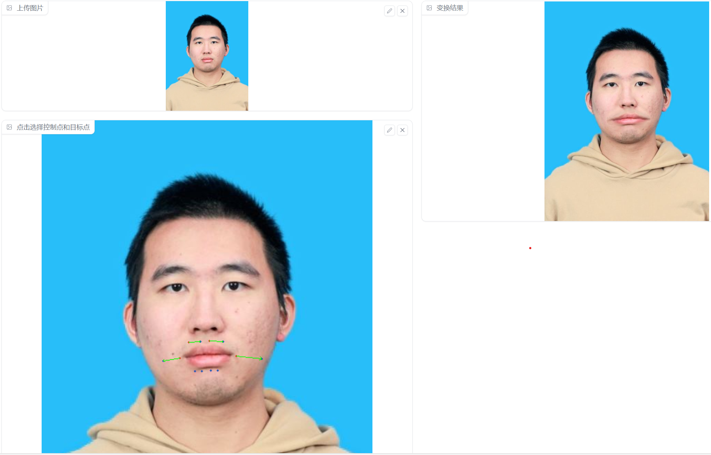
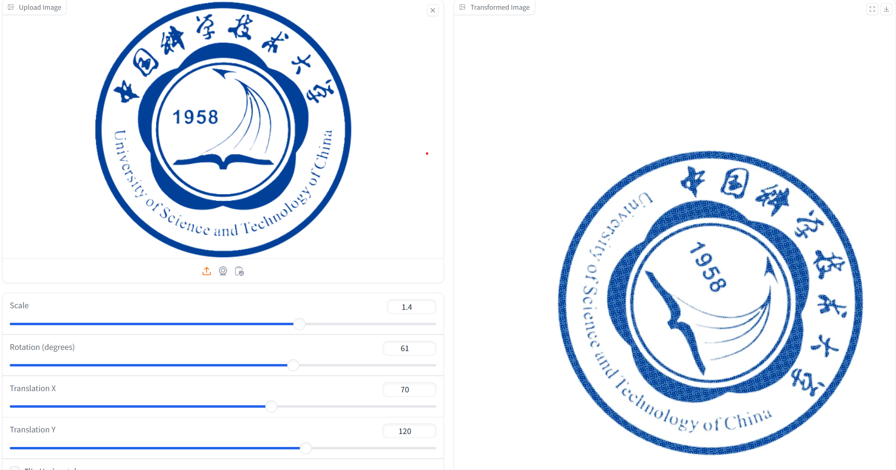

# <center>第一次实验报告</center>

<center> SA24001065 余家玮</center>

## Requirements

安装程序所需环境请执行下面语句

```python
pip install -r requirements.txt
```

注意numpy版本不能过高。

## 实验原理

为了对图片围绕中心进行平移旋转，放缩，翻转我们需要得到仿射矩阵M
$$
M_{rot}=\begin{pmatrix}
cos\theta&-sin\theta&trans_x+(1-cos\theta)*w/2+sin\theta*h/2\\
sin\theta&-cos\theta&trans_y-sin\theta*w/2+(1-cos\theta)*h/2
\end{pmatrix}\\
M_{scale}=\begin{pmatrix}
scale&0&(1-scale)*h/2\\
0&scale&(1-scale)*w/2
\end{pmatrix}\\
M_{flip}=\begin{pmatrix}
-1&0&w\\
0&1&0
\end{pmatrix}\\
$$
将这三个矩阵扩充成3*3再复合即可

为了对图片实现RBF插值我们有

RBF:该方法是要求我们得到满足以下形式的插值函数
$f_p=\Sigma_{i=1}^{n}\alpha_{i}R(d(p,p_i))+p_m(p)$

其中：$\alpha_{i}$是系数向量，Pm，R是R^2 空间上的连续函数。$\alpha_{i}$通过等式$f(p_i)=q_i$来确定，作业里取$R(x)=1/(x^2+d),P_m=p$
$\alpha_i$通过以下代码计算得出

```python
n = psrc.shpae[0];
A = np.zeros((n,n))
for i in range(n)
    for j in range(n)
    A(i,j) = 1/((psrc(j,1)-psrc(i,1))^2+(psrc(j,2)-psrc(i,2))^2+delta);
    end
end
coef = A\(pdst-psrc);
```

其中psrc pdst 分别为初始图像选中的点集，coef为所求系数向量

## 实验结果

运行下面语句可以进行图片旋转等操作

```python
python run_global_transform.py
```

运行下面语句可以进行图片插值

```python
python run_points_transform.py
```


<center>
<table>
<tr>
    
    
    </tr>
    <tr>
    
        
    </tr>
    <tr>
    
        
    </tr>
    </table>


